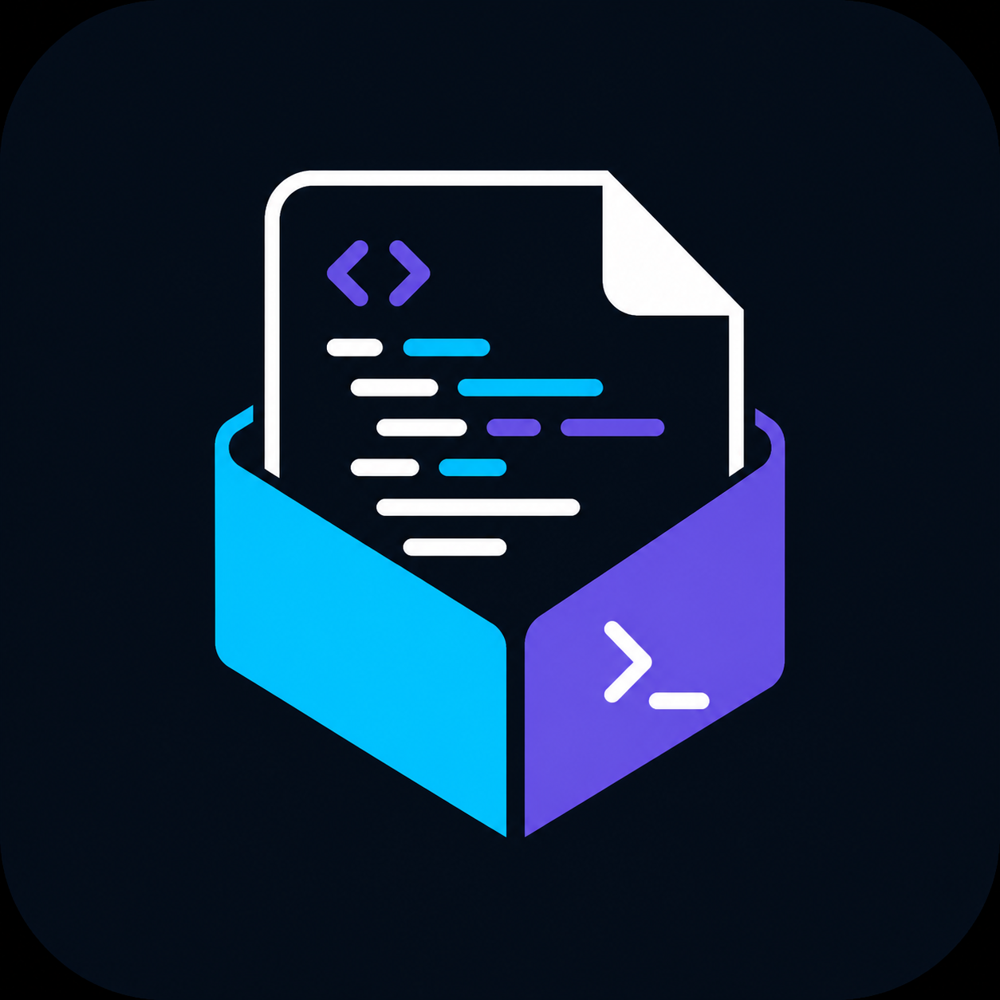

<div align="center">
  
  <h1>cxt</h1>
  <p><strong>Pack the right code for your next LLM conversation.</strong></p>
  <p>Fast, AST-aware context packing for code reviews, debugging, and AI-assisted development.</p>

  <p>
    <a href="https://github.com/chinmaykrishnroy/cxt/actions"></a>
    <a href="https://crates.io/crates/cxt"></a>
    <a href="LICENSE"></a>
  </p>
</div>

`cxt` is short for **context**.

## Why cxt?

Copying a repository into an LLM is noisy, slow, and easy to get wrong. `cxt` turns a project—or just the files relevant to an entry point or Git diff—into one clean Markdown context document.

```text
cxt --diff --trace src/main.rs --minify
```

The result is copied to your clipboard or written to a file, ready to paste into ChatGPT, Claude, Cursor, or another coding assistant.

## Highlights

- **Directory packing** that respects `.gitignore`.
- **Git diff mode** for changed and untracked files only.
- **AST dependency tracing** for JavaScript, TypeScript, Python, Rust, Go, C, C++, Java, C#, Ruby, and PHP.
- **AST-aware comment stripping** plus whitespace reduction with `--minify`.
- **Best-effort secret redaction** before output is assembled.
- **Binary, lockfile, minified-file, and size limits** to avoid accidental context explosions.
- **Clipboard-first output** with a Markdown file fallback.
- **Configurable global ignore patterns** and output limits.

## Install

### Download the latest release

The CI page verifies the code. Downloadable binaries are published on the
[Releases page](https://github.com/chinmaykrishnroy/cxt/releases/latest) when a version tag is pushed.

| Platform | Download |
| --- | --- |
| Windows x64 | [Download `.exe`](https://github.com/chinmaykrishnroy/cxt/releases/latest/download/cxt-x86_64-pc-windows-msvc.exe) |
| Windows ARM64 | [Download `.exe`](https://github.com/chinmaykrishnroy/cxt/releases/latest/download/cxt-aarch64-pc-windows-msvc.exe) |
| macOS Intel | [Download `.dmg`](https://github.com/chinmaykrishnroy/cxt/releases/latest/download/cxt-x86_64-apple-darwin.dmg) |
| macOS Apple Silicon | [Download `.dmg`](https://github.com/chinmaykrishnroy/cxt/releases/latest/download/cxt-aarch64-apple-darwin.dmg) |
| Debian/Ubuntu x64 | [Download `.deb`](https://github.com/chinmaykrishnroy/cxt/releases/latest/download/cxt_0.1.0_amd64.deb) |
| Debian/Ubuntu ARM64 | [Download `.deb`](https://github.com/chinmaykrishnroy/cxt/releases/latest/download/cxt_0.1.0_arm64.deb) |

Install downloaded packages with:

```bash
# Debian / Ubuntu
sudo dpkg -i cxt_0.1.0_amd64.deb

# macOS: open the downloaded DMG, then copy cxt to /usr/local/bin
sudo cp /Volumes/cxt/cxt /usr/local/bin/cxt
sudo chmod +x /usr/local/bin/cxt

# Windows PowerShell: run the downloaded executable
.\cxt-x86_64-pc-windows-msvc.exe --help
```

### One-command install

```bash
# macOS / Linux
curl --proto '=https' --tlsv1.2 -LsSf https://github.com/chinmaykrishnroy/cxt/releases/latest/download/cxt-installer.sh | sh

# Windows PowerShell
irm https://github.com/chinmaykrishnroy/cxt/releases/latest/download/install.ps1 | iex
```

The Windows installer places `cxt.exe` in `%LOCALAPPDATA%\Programs\cxt` and adds that directory to the current user's PATH. Open a new terminal afterward, then run `cxt --help`.

Or download a platform binary from [Releases](https://github.com/chinmaykrishnroy/cxt/releases/latest).

### From source

Requires [Rust](https://www.rust-lang.org/tools/install).

```bash
git clone https://github.com/chinmaykrishnroy/cxt.git
cd cxt
cargo install --path .
```

### Build a release binary

```bash
cargo build --release
```

The binary is created at `target/release/cxt` (`cxt.exe` on Windows).

## Quick start

```bash
# Pack the current project (the default path is the current directory)
cxt

# Pack only changed and untracked files in the current Git repository
cxt --diff

# Follow imports from one entry file
cxt src/main.rs --trace

# Trace and reduce the context size
cxt src/main.rs --trace --minify

# Write Markdown instead of using the clipboard
cxt --output context.md

# Preview the selection without producing output
cxt --dry-run
```

See every option with:

```bash
cxt --help
```

## Configuration

Configuration is optional. `cxt` checks the platform config directory and then `~/.cxtrc`.

```toml
default_minify = true
global_ignore = ["*.spec.ts", "docs/**", "fixtures/**"]
max_output_mb = 50
```

`--no-limit` bypasses the default per-file and output-size safety limits. Use it deliberately.

## Output

The output is ordinary Markdown with a heading and language-aware fenced code blocks:

~~~markdown
# Codebase Context

### File: `src/main.rs`
```rust
fn main() {}
```
~~~

The default output limit is 100 MB and the default per-file limit is 1 MB. The displayed token count is a fast estimate, not a tokenizer-specific billable count.

## Supported languages

| Language | Extensions |
| --- | --- |
| JavaScript / JSX | `.js`, `.jsx` |
| TypeScript / TSX | `.ts`, `.tsx` |
| Python | `.py` |
| Rust | `.rs` |
| Go | `.go` |
| C / C++ | `.c`, `.h`, `.cpp`, `.cc`, `.cxx`, `.hpp` |
| Java | `.java` |
| C# | `.cs` |
| Ruby | `.rb` |
| PHP | `.php` |

## Security note

Secret redaction is best-effort pattern matching, not a security boundary. Review generated context before sharing it, especially when using `--no-limit` or custom ignore rules. Keep `.env`, credentials, dumps, and private fixtures excluded through `.gitignore` or configuration.

## Development

```bash
cargo fmt -- --check
cargo test
cargo build --release
```

Contributions are welcome. Good areas include additional import resolvers, tokenizer-backed estimates, richer output formats, and more integration tests.
